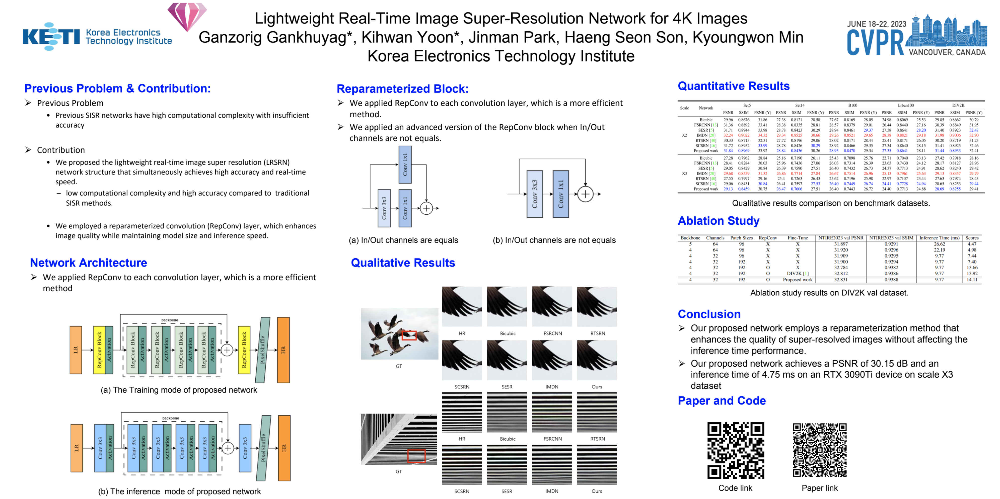

# [Lightweight Real-Time Image Super-Resolution Network for 4K Images](https://openaccess.thecvf.com/content/CVPR2023W/NTIRE/papers/Gankhuyag_Lightweight_Real-Time_Image_Super-Resolution_Network_for_4K_Images_CVPRW_2023_paper.pdf)

### Poster & Presentation Link
|  |  |
|       :---       |     :---:     |
| <a href="https://drive.google.com/file/d/1fqnAzitvML2ma1BIqreVd-mgj5n9S_Ld/view?usp=sharing"></a> | <a href="https://docs.google.com/presentation/d/1-DfdfX-8hyfIbpmmiJG90cMJ5zPHAHaG/edit#slide=id.p1"></a> |
| | |

An older version implemented based on [SimpleIR](https://github.com/xindongzhang/SimpleIR).

The following is more advanced version implemented by us.
  - Logger -> Wandb
  - Argument parsing -> use config files at ./configs/

### Dependencies & Installation

Please refer to the following simple steps for installation.

```
git clone https://github.com/Ganzooo/simple_real_time_super_resolution.git
cd simple_real_time_super_resolution
pip install -r requirements.txt
```

### Docker Setting
```
docker build --tag ntire2023 .
nvidia-docker run --name ntire2023 -it --gpus all --ipc=host --pid=host -v /your/data/path/:/dataset -v /your/sorce_code/:/source_code --shm-size=64g ntire2023:latest
pip install -U numpy

##If you use RTX A6000
pip install torch==1.12.0+cu116 torchvision==0.13.0+cu116 torchaudio==0.12.0 --extra-index-url https://download.pytorch.org/whl/cu116
```

### Dataset of SR

You can download Div2k dataset from Web [Link](https://cv.snu.ac.kr/research/EDSR/DIV2K.tar)

You can download Benchmark dataset from Web [Link] (https://cv.snu.ac.kr/research/EDSR/benchmark.tar)

Combined test dataset from Drive [Link] (https://drive.google.com/file/d/1feZltvT0COZ87SjMxJpGMsrWTk1uLibD/view?usp=sharing)
 - Combined dataset includes: 
    - Train: DIV2K train set (full 800), Flickr train set (2650 full), GTA (train seq 00 ~ 19 seq) sample 361, LSDIR (first 1000)
    - Val: DIV2K val set (full 100), Flickr val (100), GTA (90), LSDIR(100)

Path of Dataset must be set in ./config/*name_of_yaml*.yaml

### Dataset preparation for Noised LR images
You can generate LR images with compression noise.
```
## LR path & HR path must be set by manually
python source/data/prepare_data.py 
```

### Training
You could also try less/larger batch-size, if there are limited/enough hardware resources in your GPU-server.
We use simple yamlfile for various settings during training. 
You can set all Parameters at yaml file ***./config/name_of_model.yaml***
```
cd simple_real_time_super_resolution

## If you set all settings correct
python train.py --config ./config/x2_final/repConv_x2_m4c32_relu_div2k_warmup_lr5e-4_b8_p384_normalize.yml
```
### Testing
You can set all Parameters in ***./config/config_base_test.yaml***

```
## For test your model use sr_demo to check inference time.
python sr_demo.py
```

### Check Result
Validation result image, Test result image, Best weight, Last weight and log files saved in this ***./output/{DATE_of_TODAY}/{Last_folder}*** folder.
Wandb result [WANDB](https://wandb.ai/iilab/ECCV_MAI2020_SR)

### Profilling model inference time
You can check ideal model inference time by pytorch profilling tool. You can set all Parameters in ***./config/config_base.yaml***
```
## If you set all settings correct
python profiller_model.py
```
